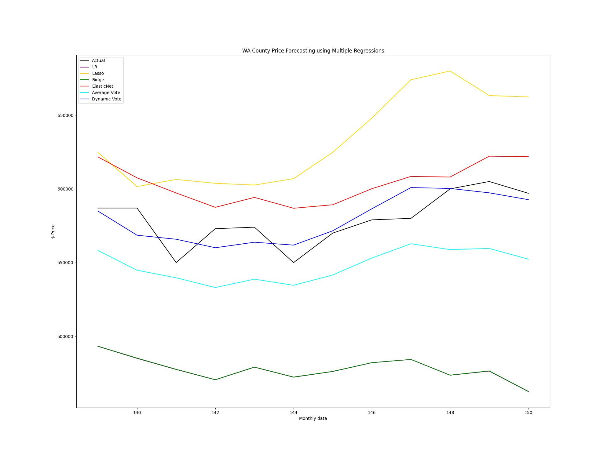
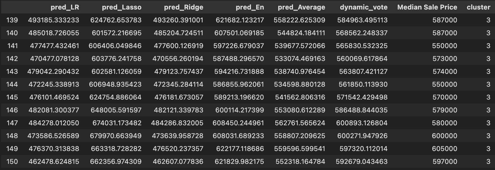

```{r setup, include=FALSE}
knitr::opts_chunk$set(echo = TRUE)

```
Last modified: 2025-01-23

## Summary

The methodology of price forecasting is interesting on its own, when applied to housing 
data it tends to perk a few ears. This article focuses on developing multiple models, 
regime analysis, and weighted ensembles taking into account historical performance within regimes.
This project is inspired by the phrase "wisdom of the crowd", which essentially 
says that a collective groups aggregate opinions, predictions, judgement etc. 
tend to be more accurate than one particular member. We draw an analogy to this phrase in model forecasting, 
hence developing individual models with a common target variable and taking the
aggregate forecast. Going a step further we create a dynamically weighted forecast
which weights the models based on historical model performance within regimes. This conceptually
makes sense as if we were out at trivia night with 5 friends (all whom have different specialties)
though we would all have an answer to the trivia question within our group, the answer
we go with would likely be weighted in favor of the friend whose field of expertise 
overlaps the topic of the question. 

## The Data

For housing we use the data available from RedFin's data center. We focus on Washington County
in Oregon because that is where I grew up and I have further research in that particular area due 
to Intel's recent struggles (Intel employees roughly 25,000 people in WA County and surrounding counties).
The RedFin data consists of the features available as shown below, with the target variable being 
Median Sale Price for the county. A correlation plot is shown of the feature data as well. 
```{python, echo=FALSE}
import pandas as pd 
import numpy as np
df1 = pd.read_csv('rdfn_wa_county_updated_.csv')
print("Names of Features and Target variable")
for i in df1.keys():
  if i == "Median Sale Price":
    print(i, '**** Target Variable****')
  else:
    print(i)

#print(df1.iloc[:, 1:])  # Hardcoding to show first 3 columns only
```

```{r, echo=FALSE, fig.align='center'}

```

For the regime analysis we use some common indicators from FRED. Having talked to portfolio
managers in the financial industry it seems that keeping the dataset simple when identifying regimes
is not too far from what is actually practiced in the industry. We will be using Federal Funds Rate,
Housing Starts, Unemployment Rate, and CPI all matching the RedFin frequency of monthly. We get rid of
look ahead bias by lagging the macro data by one month. As all but the Federal Funds Rate data
comes out near the middle of the month for the previous months value. A one month lag is suffice to keep things
realistic. Below is a sample of the regimes dataset.


```{python, echo=FALSE}
import pandas as pd 
import numpy as np
pd.set_option('display.max_columns', None)  # Show all columns
pd.set_option('display.expand_frame_repr', False) 
df2 = pd.read_csv('4_regimes_monthly_updated_.csv')
print(df2)
```

## The Models and how they were created

Machine Learning is a subset of the AI hype and to follow trends we incorporate
multiple ML models in this article. However, because of the sparseness of the available dataset 
(roughly 150 instances) models which require large amounts of data such as 
ANN/DNN, Random Forest, and SVR were tested out and performed poorly. The regression models outperformed 
hence the article will focus on Linear, Lasso, Ridge, and Elastic Net regression models.
All the models were predicting the same target variable of "Median Sale Price" for
the next month, with the feature matrix taking into account the previous 24 months of data. 

#### Splitting Train/Test 

This is broken into two parts. The first splitting of train/test are for the regression and 
regime models these include the instances from dates 1/12 to 7/23. Training of the models use 
50% of the data (1/12 to 10/16) in the stated date ranges, with 10% of the training data used for validation,
with the remaining (11/16 to 7/23) instances used for testing. 

The second split is for the instances within dates 8/23 to 7/24. This is the final testing 
period which we are able to test how the dynamically weighted forecast performs. 

This is not the typical train/test split. It is done so that we can
have a period of testing time in which we are able to see regime changes in which we can
evaluate performance of each model within that regime with a degree of confidence.
It's not perfect but we work with it. 

#### The Models
Looking at the correlation plots we see multicollinearity. We attempt to address this
with the choice of models used. Linear Regression is the base case in which
all features are used without addressing redundancy in the features. 

We then use Lasso, Ridge, and Elastic Net Regression which address, feature selection, 
multicollinearity, and overfitting via regularization. 
Regularization techniques add penalty terms to the cost function by either L1 (Lasso), L2 (Ridge), or 
a combination (L1 + L2) Elastic Net regression. 

The penalty terms added
to the cost function differ for Lasso from ridge in that it uses absolute value of 
the coefficients as a penalty in which coefficients can be driven to 0. 
This translates to potentially getting rid of some features all together 
(optimal for feature selection). 

Ridge deals with L2 regularization which adds a penalty term of squaring the 
coefficients to the cost function. This penalizes large coefficients and leads 
them towards zero but does not completely get rid of them (optimal for dealing with
multicollinearity). This differs from Lasso as it still utilizes all of the 
features and does not throw any out. 

Elastic Net is a mix of both Lasso and Ridge. It adds both penalty terms from 
Lasso and Ridge to its cost function. The strength of favoring one (L1 or L2)
over the other is defined by a ratio (hyperparameter)
and the strength of that ratio (another hyperparameter) can vary as well. 

Overall these models have unique strengths in dealing with our feature matrix.
Lasso is optimal for feature selection, ridge ideal for dealing with multicollinearity,
and Elastic Net is a mix of both, with all three utilizing regularization techniques
to minimize overfitting. 

#### Performance of the Models
All models then had their applicable hyperparameters optimized via standard gridseach cv.
That being done, performance is measured off a scaled Mean Squared Error. The reason
for scaling is due to the prices being large in the thousands of dollars, hence squaring
any error becomes even more large. (All models did have their features data uniquely scaled).
Below we see how the models performed in terms of MSE. The LR, and Ridge are
essentially the same (this is because the optimal  hyperparameter alpha for Ridge is near 0). 
The best performing models turned out to be Lasso/Elastic Net, with an
equally weighted average model coming in second. The weighted average model is just 
that, it is the average of the ensembles forecast. 

```{python, echo=FALSE}
import pandas as pd 
df_mse = pd.read_csv('df_mse.csv')
print(df_mse.iloc[:,1:])
```


## Regimes and how they were identified
Regimes are beneficial in getting an understanding of the environment. In regards
to trading, regime changes can dictate what type of algorithmic strategy to deploy. 
Looking at a simple example we may have 2 unique strategies that perform differently 
dependent on volatility (looking at a 1 variable environment). Strategy 1 does well with high
volatility, strategy 2 does well with low volatility. So it would make sense to deploy these
strategies in the environment which they perform best in right? This is where identifying
regimes makes sense as it's a method to gauge what the overall environment is, and once
the regime is identified then the decision of what algorithm to deploy can be made.  

For our particular project regimes were identified using unsupervised learning 
on the macro economic dataset. We identified regimes on the same training 
time frame (11/16 to 7/23) to evaluate model performance within each regime. 
These performance statistics will be the substance to the dynamically 
weighted model during the final testing period (8/23 to 7/24) as the regression
models will be weighted dependent on the historical performance evaluated during
the training period. 

#### Step by step breakdown of our regime analysis
1. First we use Principal Component Analysis for dimensionality reduction of our macro economic dataset.
2. Then we establish which K-means model to go with dependent on silhouette scores.
3. With the time frames being aligned with the RedFin dataset we cross-reference
   and identify a regime for each month using the established K-means model. 
4. Finally, performance (MSE) of how each model played out within the training 
   period (11/16 to 7/23) can be established. These metrics will be used 
   in creating the dynamically weighted model. 

#### Model performance within Regimes
We look at the counts of regimes which occurred in our initial testing set (Excluding:8/23-7/24).
We see that the distribution is fairly even amongst clusters 0, 1, and 3. Due to the scarcity of 
the data available we will move forward even with performance of cluster 2 not being 
ideally portrayed. 
```{python, echo=FALSE}
performance_count = pd.read_csv('performance_count_regime.csv')
print(performance_count)
```

We then evaluate to see how the models performed during each regime. This is our
sought after performance metric. We see that Lasso and Elastic Net in general performed well in most
regimes. 
```{python, echo=FALSE}
cluster_mse = pd.read_csv('cluster_analysis.csv')
print(cluster_mse)
```

## Putting it all together
Let's see how it all comes together with evaluating the performance of the models
by testing the model forecasts through 7/23. 

```{r, echo=FALSE, out.width="100%", fig.align='center'}

```
The above plot shows how each model played out till 7/23, along with
an average vote model (which is exactly as it sounds the averaging the forecasts of 
all the models). We see that there really is no consistent "winning" model. It seems
that each model (including the average vote) has periods of strength. This is could be
seen as somewhat of a positive sign that the dynamically weighted model may perform well.  

### Creating the Dynamically weighted model
Knowing the performance of each model in particular regimes we 
then create a dynamically weighted model. This model dynamically weights 
the forecast based on individual model performance within the regime which is identified using 
our K-means model.The weights are calculated using the inverse (and normalized) of the model MSE's 
within that regime which was found earlier. Higher weighting was allotted to the models which 
have a lower MSE score within that particular regime. Doing so we come up with a 
weight matrix per regime as shown below.

```{python, echo=FALSE}
weights_matrix = pd.read_csv('df_weights.csv')
print(weights_matrix)
```

We then test out how our models would perform in the final testing period 8/23 to 7/24. 
We have all 4 regression models, the average weight model, and the dynamically weighted
model plots shown below. Keep in mind the reason the blue curve is shorter than the others are because
in order for it to be calculated it required weights per identified regime.
In order to come up with the weights, we needed to evaluate performance 
(both regression, and K-means models) in the initial testing period (11/16-7/23). We now 
see how all models performed for the remaining data (8/23-7/24) as shown below.
```{r, echo=FALSE, out.width="100%", fig.align='center'}

```

Taking a closer look it is quite clear that the dynamically weighted model 
did outperform the other models. 
```{r, echo=FALSE, out.width="100%", fig.align='center'}

```

Below we see the MSE and actual forecasts from all of the models during the final 
testing period.
```{python, echo=FALSE}
df_mse_final = pd.read_csv('df_mse_final.csv')
print(df_mse_final.iloc[:, 1:])
```

```{r, echo=FALSE, out.width="100%", fig.align='center'}

```

## Conclusion 

We see that the term "wisdom of the crowd" makes sense for this particular project. 
During the final test set forecasting (8/23 to 7/24) we see that the dynamically weighted
model outperforms all other models both visually and according to MSE. Linear and Ridge Regression seem to 
have had one to many at trivia night and the model's forecasting isn't particularly 
coherent, however this is captured in the dynamically weighted model by limiting their 
forecasting weights. During the final testing period the regime was consistently 
identified as being regime 3 through our K-Means model. And historically during
regime 3, the best performing models were Lasso and Elastic Net which
got higher weighting (around 70%) compared to Linear and Ridge Regressions (less than 30%). 
Overall, it seems a dynamically weighted model plays out nicely. 


